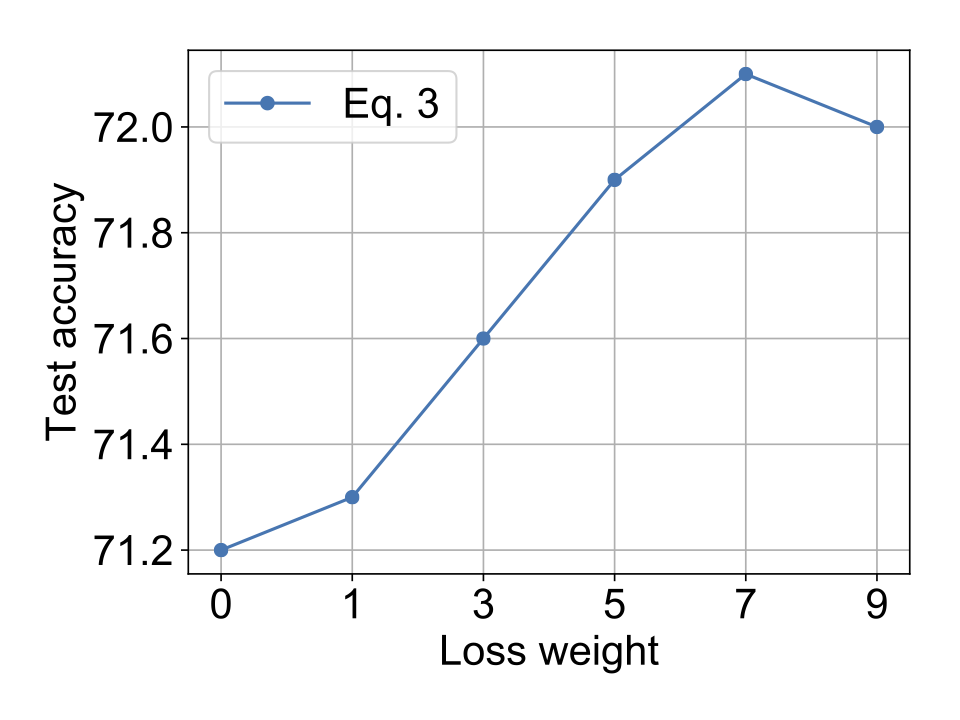
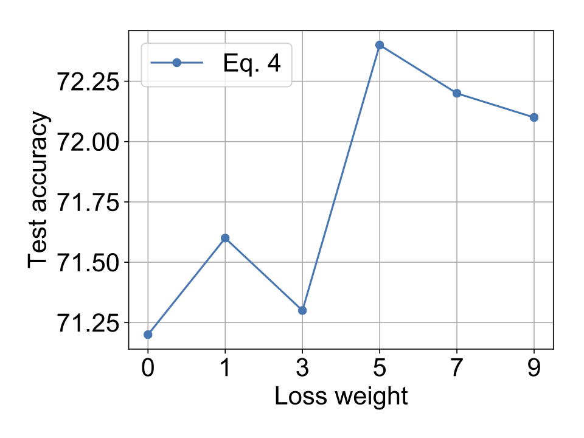
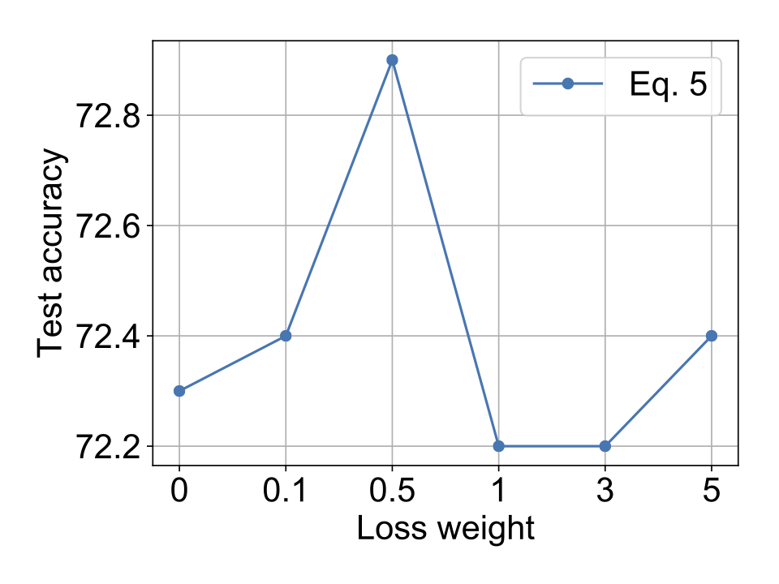

# Episodic-DG
This is the repo for reproducing the results in the paper Episodic Training for Domain Generalization.

##### Data
Please download the data from https://drive.google.com/open?id=0B6x7gtvErXgfUU1WcGY5SzdwZVk and use the official train/val split.
##### ImageNet pretrained model
We use the pytorch pretrained ResNet-18 model from https://download.pytorch.org/models/resnet18-5c106cde.pth

## Enviroments

verified on
> GPU GeForce RTX 2080 Ti \
> pytorch 1.0.0 \
> Python 3.7.3 \
> Ubuntu 16.04.6

| Method  | Art | Cartoon | Photo | Sketch | Ave. |
| ------------- | ------------- | ------------- | ------------- | ------------- | ------------- |
| AGG  |76.1	|75.2	|94.9	|69.7	| 79.0|
| Epi-FCR  | 79.6|	76.8|	93.7|	77.1|	81.8|

and 

> GPU TITAN X (Pascal) \
> pytorch 0.4.1 \
> Python 2.7 \
> Scientific Linux 7.6

| Method  | Art | Cartoon | Photo | Sketch | Ave. |
| ------------- | ------------- | ------------- | ------------- | ------------- | ------------- |
| AGG  |77.6	|73.9	|94.4	|70.3	| 79.1|
| Epi-FCR  | 82.1|	77.0|	93.9|	73.0|	81.5|

## Run

sh run_main_epi_fcr.sh #data_folder #model_path \
sh run_main_agg.sh #data_folder #model_path

### Sensitivity of loss weights (each point is the average performance of 20 runs on VLCS)

lambda_1            |  lambda_2 |  lambda_3
:-------------------------:|:-------------------------:|:-------------------------:
  |   | 


### Reference
If you consider using this code or its derivatives, please consider citing:

```
@InProceedings{Li_2019_ICCV,
author = {Li, Da and Zhang, Jianshu and Yang, Yongxin and Liu, Cong and Song, Yi-Zhe and Hospedales, Timothy M.},
title = {Episodic Training for Domain Generalization},
booktitle = {The IEEE International Conference on Computer Vision (ICCV)},
month = {October},
year = {2019}
}
```

### Note

When working with a different enviroment, you can get different results and need to tune the hyper parameters yourself.

